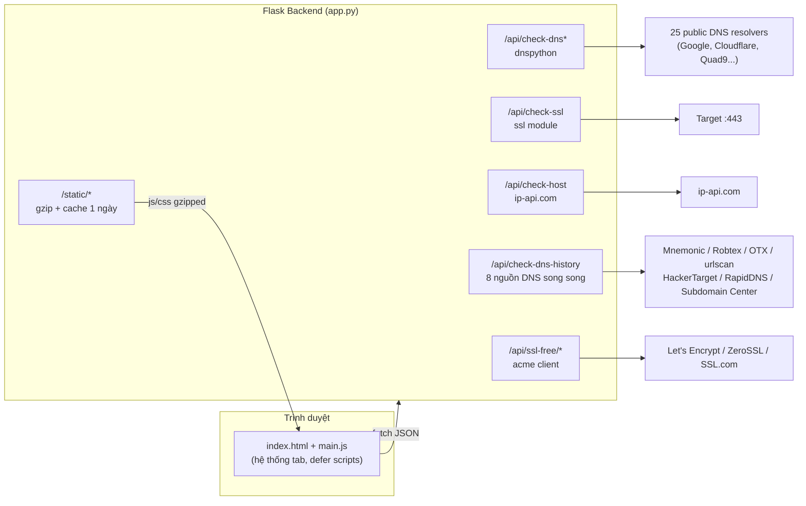

# All-Tool — Network Tools Web App

> Bộ công cụ Web cho quản trị viên hệ thống / webmaster: kiểm tra DNS, SSL, Host, tra cứu lịch sử DNS và cấp chứng chỉ SSL miễn phí (ACME).
> Backend: **Python Flask** · Frontend: **HTML + Vanilla JS (main.js)** · Ngôn ngữ UI: **Tiếng Việt**

---

## 📖 Tài liệu cho AI / Developer mới (đọc trước)

Ứng dụng này là **một trang web duy nhất** (`/`) với **hệ thống tab** (sidebar bên trái). Toàn bộ logic nằm ở:

| File | Vai trò |
|---|---|
| `app.py` (~4200 dòng) | Toàn bộ backend Flask — 30 REST endpoints |
| `static/js/main.js` (~4000 dòng) | Toàn bộ frontend logic, gọi API bằng `fetch` |
| `static/css/style.css` (~3800 dòng) | Toàn bộ style (glassmorphism theme) |
| `templates/index.html` | Khung trang + include các tab từ `templates/tabs/*.html` |
| `whois_lookup.py` | Module WHOIS (dùng endpoint `whois.pavietnam.net`) |
| `python_detector.py` | Detect Python interpreter trên máy chủ |
| `acme/` | Lưu trữ order/key/session ACME (SSL miễn phí) |

> ⚠️ **Đã xoá (2026-09-16):** `import-ssl.sh`, endpoint `/api/install-ssl`, toàn bộ JS `installSsl*` — tính năng "Install SSL" cũ không còn trong codebase.

### Cách chạy

```bash
# 1. Tạo venv & cài dependencies
python -m venv .venv
.venv/Scripts/python -m pip install -r requirements.txt   # Windows (Git Bash)
# .venv/bin/python -m pip install -r requirements.txt     # Linux/macOS

# 2. Chạy server (port mặc định 5000, đổi bằng env PORT)
./run_server.sh          # script tự detect python
# hoặc:
.venv/Scripts/python.exe app.py

# 3. Mở http://localhost:5000
```

Dependencies: `Flask`, `Flask-Cors`, `dnspython`, `cryptography`, `requests`, `acme`, `josepy`.

Deploy Render: xem `render.yaml` (runtime python, start `bash run_server.sh`).

---

## 🗺️ Sơ đồ kiến trúc & luồng hoạt động



### Mô tả từng tab (flow người dùng)

| Tab | Flow | API chính | Trạng thái khi test |
|---|---|---|---|
| **DNS** | Nhập domain → chọn record types (A/AAAA/CNAME/MX/TXT/NS/SOA/CAA) → query **song song 25 resolver** → hiển thị so sánh kết quả + trạng thái propagate | `POST /api/check-dns` (detail), `/api/check-dns-basic` | ✅ Hoạt động tốt (google.com: 23/25 resolver thành công) |
| **Bulk DNS** | Dán danh sách domain → resolve hàng loạt → bảng IP/MX/NS | `POST /api/check-dns-bulk` | ✅ OK (test 2 domain) |
| **DNS History** | Nhập domain → tổng hợp DNS/passive DNS từ **8 nguồn miễn phí không cần API key** → dedupe, gom theo từng mốc thời gian và từng record type (A/AAAA/MX/NS/TXT/CNAME/SUBDOMAIN), mở rộng first/last seen giữa các nguồn | `POST /api/check-dns-history` | ✅ OK |
| **Host Check** | Nhập IP/domain → IP, ASN, ISP, reverse DNS, geolocation (ip-api.com) | `POST /api/check-host` | ✅ OK |
| **WHOIS** | Ưu tiên API `whois.net.vn` cho quốc tế và `.vn`, sau đó RDAP chuẩn, WHOIS port 43 và fallback PA Việt Nam | `POST /api/whois` | ✅ OK |
| **Email Auth** | Quét SPF, DKIM, DMARC, MX; tự động thử selector DKIM theo catalogue của Google Workspace, Microsoft 365, cPanel, iRedMail, MDaemon, Mailcow, Kerio, DirectAdmin và hiển thị Found/Not found từng record | `POST /api/check-email-auth` | ✅ OK |
| **SSL Check** | Nhập domain → lấy cert từ :443 → status, hạn còn lại, issuer, SAN, redirect và toàn bộ chain (Leaf, Chain 1, Chain 2...) | `POST /api/check-ssl` | ✅ OK |
| **SSL Bundle** | Upload ZIP / scan folder / paste PEM → tách & gộp cert+CA bundle, kiểm tra match key | `POST /api/ssl-upload`, `GET /api/ssl-catalog`, `POST /api/check-cert-file` | ✅ Đã fix đường dẫn (env `SSL_CATALOG_DIR`) |
| **SSL Decoder** | 3 mode: Match Checker (cert↔key), Certificate Decoder, CSR Decoder | client-side (forge.js) + `POST /api/check-cert-file` | ✅ UI render OK |
| **SSL Miễn Phí** | Wizard 5 bước: nhập domain/SANs → chọn CA (LE/ZeroSSL/SSL.com) → chọn DNS-01/HTTP-01 → server tạo CSR+order ACME → user thêm TXT record → verify → nhận cert 90 ngày | `POST /api/ssl-free/start` → `/check-challenge` → `/finalize` → `GET /list` | ✅ Đã fix lỗi JS load (bỏ gọi installSsl) |

Tab `Install SSL` và tab `AI Chat` đã bị **xoá hoàn toàn** khỏi codebase (2026-09-16): endpoint `/api/install-ssl`, `/api/ai/*`, toàn bộ JS/CSS liên quan đều đã dọn sạch.

### Danh sách API endpoints

```
GET  /                          Trang chính
GET  /ping                      Health check
GET  /api/python-info           Thông tin Python trên server
GET  /api/system-info           Thông tin hệ thống
POST /api/check-dns             DNS checker chi tiết (25 resolvers)
POST /api/check-dns-basic       DNS checker rút gọn
POST /api/check-dns-bulk        DNS hàng loạt
POST /api/check-dns-history     DNS/passive DNS history (8 nguồn miễn phí)
POST /api/whois                 WHOIS (qua whois.pavietnam.net)
GET  /api/record-types          Danh sách record types
GET  /api/dns-servers           Danh sách DNS servers
POST /api/clear-cache           Xoá cache DNS
POST /api/check-ssl             Kiểm tra chứng chỉ SSL domain
POST /api/check-host            IP/ASN/geolocation của host
POST /api/check-email-auth     SPF/DKIM/DMARC/MX và mail platform fingerprints
POST /api/ssl-catalog           Quét thư mục cert trên server
POST /api/ssl-upload            Upload ZIP/folder cert
POST /api/check-cert-file       Parse file cert
POST /api/ssl-free/start        Bắt đầu order ACME (tạo CSR, gửi order)
POST /api/ssl-free/check-challenge   Verify DNS-01/HTTP-01
POST /api/ssl-free/finalize     Hoàn tất, tải cert
POST /api/ssl-free/clear-dns-cache  Xoá cache DNS interno
GET  /api/ssl-free/list         Danh sách order đã lưu
GET/DELETE /api/ssl-free/item/<id>   Chi tiết / xoá order
GET  /api/ssl-free/session/<id>/status  Trạng thái session
```

### Biến môi trường

| Biến | Mặc định | Ý nghĩa |
|---|---|---|
| `PORT` | `5000` | Port server |
| `SSL_CATALOG_DIR` | `~/Desktop/ssl` | Thư mục mặc định cho SSL Bundle scan folder |
| `WHOIS_CACHE_TTL_SECONDS` | `15` | TTL cache WHOIS |

---

## 🔍 Kết quả kiểm tra flow (2026-09-16, Windows + Git Bash — sau đợt fix)

| Kiểm thử | Kết quả |
|---|---|
| Load trang: lỗi console/JS | ✅ **0 lỗi** (trước: 2 lỗi) |
| `POST /api/check-dns` cloudflare.com A | ✅ 24/25 resolvers |
| UI tab SSL Check: cloudflare.com | ✅ Hiển thị leaf + full certificate chain |
| UI tab Host Check: 1.1.1.1 | ✅ IP/ASN/ISP/reverse DNS |
| UI tab DNS History: github.io | ✅ **sẽ thay đổi theo nguồn khả dụng**, không còn trộn dữ liệu CT Logs thành TXT |
| Gzip static files | ✅ main.js 194KB → **37.5KB** (giảm 81%) |
| DCL / Load time | ✅ ~700ms (trước: chặn 8.5s do fetch AI models) |
| Transfer size trang | ✅ ~63KB lần đầu (trước: ~320KB) |
| Tab AI Chat đã xoá hoàn toàn | ✅ `/api/ai/*` trả về 404, 0 hàm AI trong JS, 0 console error |

---

## ⚠️ Các vấn đề đã biết (phân tích)

### Đã sửa ✅ (2026-09-16)
1. ✅ **Lỗi JS `installSslLoadCatalog`** — xoá toàn bộ code install-ssl khỏi `main.js` (192 dòng) + backend route `/api/install-ssl` + `import-ssl.sh`.
2. ✅ **404 `theme-premium.css`** — bỏ `<link>` khỏi `index.html`.
3. ✅ **Hardcode `/home/nvpa/Desktop/ssl`** — chuyển sang env `SSL_CATALOG_DIR` (mặc định `~/Desktop/ssl`).
4. ✅ **`mkdtemp(dir='/tmp')`** — dùng tempfile mặc định (không lỗi Windows).
5. ✅ **Chặn 8.5s lúc load** — xoá hoàn toàn tab AI Chat (frontend + backend `/api/ai/*` + CSS), không còn fetch model lúc startup.
6. ✅ **DNS History ít dữ liệu / sai loại** — dùng 8 nguồn DNS/passive DNS miễn phí, bỏ crt.sh vì đây là Certificate Transparency chứ không phải DNS; bổ sung HackerTarget DNS, RapidDNS và Subdomain Center; merge cross-source + dedupe thông minh.
7. ✅ **DNS History khó đọc** — thiết kế lại record item: badge màu theo record type, IP đậm màu xanh, live-dot xanh nhấp nháy cho record còn hiệu lực, filter theo type, limit render 60 records + nút "Xem thêm".
8. ✅ **SSL thiếu certificate chain** — TLS handshake lấy toàn bộ chain server trình bày, parse từng certificate và hiển thị Leaf/Chain 1/Chain 2 với CN, issuer, organization, hạn, serial, signature và SAN.
8. ✅ **Vệ sinh repo** — xoá `__pycache__`, `server.log`, `ssl_history.db`, `proxy.txt`, ~40 script rác (`fix*.py`, `inject_tools*.py`...), backup files; `.gitignore` đầy đủ.
9. ✅ **Hiệu năng** — gzip static (route tùy chỉnh + chống path traversal), `Cache-Control: max-age=86400`, `defer` cho CDN scripts, guard lucide icons.
10. ✅ **Xoá toàn bộ AI Chat** — bỏ ~800 dòng JS (`aiChats`, `loadAIModels`, `sendAIRequest`...), ~900 dòng Python (routes `/api/ai/*`, `AI_TOOLS`, `execute_ai_tool`, `fetch_nvidia_models`...), ~550 dòng CSS (`.ai-*`), imports thừa (`HTTPAdapter`, `Retry`, `stream_with_context`), file `tab_ai.html.bak`.

### Còn tồn tại 🟠
1. **Bug layout mobile (<980px):** `.tab-nav` sticky `height:100vh` đè kín content — chưa sửa do cần thiết kế mobile riêng. Fix nhanh: trong media query mobile đặt `.tab-nav { position: relative; height: auto; max-height: none; }`.
2. **CORS `*` toàn bộ** — cân nhắc khi deploy công khai.
3. **CDN dependencies** (lucide/jszip/forge/fonts) — offline mất icon & một số tính năng.
4. **Flask dev server** — production nên dùng waitress/gunicorn.

---

## 🧭 Gợi ý thứ tự sửa (nếu tiếp tục phát triển)

1. Fix media query mobile `<980px` (bug tương tác nghiêm trọng nhất còn lại).
2. Refactor: tách `app.py` thành blueprint theo nhóm chức năng (dns/ssl/acme), tách `main.js` thành module.
3. Production: waitress/gunicorn + reverse proxy nginx (gzip + cache tại đó).

## License

MIT License - Feel free to use and modify

